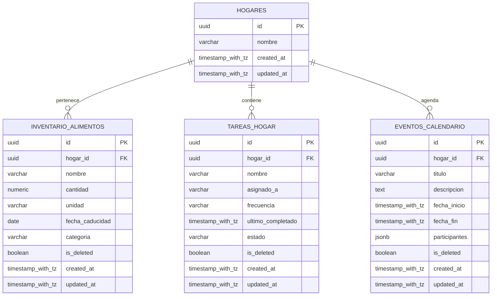

# 01_CONTEXTO_Y_ARQUITECTURA_APP

Este documento especifica la arquitectura del sistema, el esquema de la base de datos relacional y el contrato de endpoints de la API para el **Asistente del Hogar IA**. Sirve como fuente de verdad y contrato para los agentes Frontend, Backend y Base de Datos.

---

## 1. Estructura de Directorios del Monorepo

```text
AsistenteHogar/
├── .agents/
│   └── rules/
│       ├── projectmaster.md
│       ├── DB-Architect.md
│       ├── Pydantic-Enforcer.md
│       └── Tailwind-Stylist.md
├── backend/
│   ├── app/
│   │   ├── api/
│   │   │   ├── routers/       # Controladores de endpoints (FastAPI)
│   │   │   └── deps.py        # Dependencias de inyección (DB session, etc.)
│   │   ├── core/              # Configuración global, variables de entorno, seguridad
│   │   ├── models/            # Modelos SQLAlchemy 2.0
│   │   ├── repositories/      # Capa de acceso a datos (Patrón Repositorio)
│   │   ├── schemas/           # Esquemas de validación Pydantic v2
│   │   ├── services/          # Lógica de negocio e integración con LLM
│   │   └── main.py            # Punto de entrada de FastAPI
│   ├── migrations/            # Migraciones de Alembic
│   ├── alembic.ini
│   ├── requirements.txt
│   └── .env.example
└── frontend/
    ├── assets/                # Imágenes estáticas y recursos locales
    ├── src/
    │   ├── components/        # Componentes visuales puros y reutilizables (TSX)
    │   ├── hooks/             # Custom Hooks (Lógica, fetch, estado, grabadora)
    │   ├── navigation/        # Navegación de Expo/React Navigation
    │   ├── screens/           # Pantallas completas (TSX de nivel de página)
    │   ├── state/             # Estado global ligero (Zustand)
    │   └── utils/             # Funciones utilitarias y llamadas a APIs
    ├── tailwind.config.js     # Configuración de Tailwind para NativeWind
    ├── tsconfig.json
    ├── App.tsx                # Punto de entrada del cliente Expo
    └── package.json
```

---

## 2. Esquema de Datos Relacional (PostgreSQL)

La base de datos cuenta con 4 tablas principales con restricción de unicidad y un modelo de datos estrictamente relacional. Todas las marcas temporales se almacenan con zona horaria (`TIMESTAMP WITH TIME ZONE`).



### 2.1 Tabla: `hogares`
* **id**: `UUID` (PRIMARY KEY, default `gen_random_uuid()`).
* **nombre**: `VARCHAR(100)` NOT NULL (Ej. "Familia Navarro").
* **created_at**: `TIMESTAMPTZ` NOT NULL DEFAULT `timezone('utc'::text, now())`.
* **updated_at**: `TIMESTAMPTZ` NOT NULL DEFAULT `timezone('utc'::text, now())`.

### 2.2 Tabla: `inventario_alimentos`
* **id**: `UUID` (PRIMARY KEY, default `gen_random_uuid()`).
* **hogar_id**: `UUID` (FOREIGN KEY ref `hogares.id` ON DELETE CASCADE, NOT NULL, INDEXED).
* **nombre**: `VARCHAR(150)` NOT NULL (Nombre del producto).
* **cantidad**: `NUMERIC(10, 2)` NOT NULL DEFAULT `0.00`.
* **unidad**: `VARCHAR(30)` NOT NULL (Ej. "unidades", "litros", "gramos").
* **fecha_caducidad**: `DATE` NULL (Fecha de vencimiento para alertas).
* **categoria**: `VARCHAR(50)` NOT NULL (Ej. "Lácteos", "Despensa", "Carnes", "Verduras").
* **is_deleted**: `BOOLEAN` NOT NULL DEFAULT `FALSE` (Borrados lógicos).
* **created_at**: `TIMESTAMPTZ` NOT NULL DEFAULT `timezone('utc'::text, now())`.
* **updated_at**: `TIMESTAMPTZ` NOT NULL DEFAULT `timezone('utc'::text, now())`.

### 2.3 Tabla: `tareas_hogar`
* **id**: `UUID` (PRIMARY KEY, default `gen_random_uuid()`).
* **hogar_id**: `UUID` (FOREIGN KEY ref `hogares.id` ON DELETE CASCADE, NOT NULL, INDEXED).
* **nombre**: `VARCHAR(200)` NOT NULL (Descripción de la tarea familiar).
* **asignado_a**: `VARCHAR(100)` NULL (Miembro de la familia asignado, opcional).
* **frecuencia**: `VARCHAR(50)` NOT NULL (Ej. "diaria", "semanal", "mensual", "ocasional").
* **ultimo_completado**: `TIMESTAMPTZ` NULL (Fecha y hora de la última ejecución).
* **estado**: `VARCHAR(30)` NOT NULL DEFAULT `'pendiente'` (Ej. `'pendiente'`, `'completado'`).
* **is_deleted**: `BOOLEAN` NOT NULL DEFAULT `FALSE` (Borrados lógicos).
* **created_at**: `TIMESTAMPTZ` NOT NULL DEFAULT `timezone('utc'::text, now())`.
* **updated_at**: `TIMESTAMPTZ` NOT NULL DEFAULT `timezone('utc'::text, now())`.

### 2.4 Tabla: `eventos_calendario`
* **id**: `UUID` (PRIMARY KEY, default `gen_random_uuid()`).
* **hogar_id**: `UUID` (FOREIGN KEY ref `hogares.id` ON DELETE CASCADE, NOT NULL, INDEXED).
* **titulo**: `VARCHAR(200)` NOT NULL (Nombre del evento o cita).
* **descripcion**: `TEXT` NULL.
* **fecha_inicio**: `TIMESTAMPTZ` NOT NULL (Con zona horaria).
* **fecha_fin**: `TIMESTAMPTZ` NOT NULL (Con zona horaria).
* **participantes**: `JSONB` NULL (Listado de strings con los nombres de los miembros).
* **is_deleted**: `BOOLEAN` NOT NULL DEFAULT `FALSE` (Borrados lógicos).
* **created_at**: `TIMESTAMPTZ` NOT NULL DEFAULT `timezone('utc'::text, now())`.
* **updated_at**: `TIMESTAMPTZ` NOT NULL DEFAULT `timezone('utc'::text, now())`.

---

## 3. Contratos de la API REST (Rutas y Payloads)

Todos los endpoints retornarán cabeceras JSON estándares. El prefijo global de la API es `/api/v1`.

### 3.1 Módulo: Dashboard (Briefing Diario)
#### `GET /api/v1/hogares/{hogar_id}/briefing`
* **Descripción:** Invoca al LLM backend (con temperatura 0) para analizar el estado de alimentos (caducidades próximas) y eventos/conflictos de calendario del día, generando un briefing en texto plano.
* **Respuesta (200 OK):**
```json
{
  "hogar_id": "uuid-del-hogar",
  "fecha": "2026-06-09",
  "briefing": "Buenos días familia. Hoy en el calendario hay un conflicto: la cita médica de Juan se solapa con la reunión escolar a las 10:00. Además, recuerden que la leche y el pollo en la despensa caducan mañana."
}
```

### 3.2 Módulo: Despensa (Inventario)
#### `GET /api/v1/hogares/{hogar_id}/inventario`
* **Descripción:** Obtiene los elementos activos del inventario (donde `is_deleted = false`).
* **Respuesta (200 OK):**
```json
[
  {
    "id": "uuid-item",
    "nombre": "Leche entera",
    "cantidad": 3.0,
    "unidad": "litros",
    "fecha_caducidad": "2026-06-10",
    "categoria": "Lácteos",
    "created_at": "2026-06-09T10:00:00Z",
    "updated_at": "2026-06-09T10:00:00Z"
  }
]
```

#### `POST /api/v1/hogares/{hogar_id}/inventario`
* **Descripción:** Agrega un nuevo producto a la despensa.
* **Cuerpo de la Petición:**
```json
{
  "nombre": "Pollo fresco",
  "cantidad": 1.5,
  "unidad": "gramos",
  "fecha_caducidad": "2026-06-10",
  "categoria": "Carnes"
}
```
* **Respuesta (201 Created):** Retorna el objeto creado con su ID generado.

#### `PUT /api/v1/hogares/{hogar_id}/inventario/{item_id}`
* **Descripción:** Actualiza cantidad o datos de un producto.
* **Cuerpo de la Petición (Parcial):**
```json
{
  "cantidad": 1.0,
  "fecha_caducidad": "2026-06-11"
}
```
* **Respuesta (200 OK):** Retorna el objeto actualizado.

#### `DELETE /api/v1/hogares/{hogar_id}/inventario/{item_id}`
* **Descripción:** Borrado lógico del producto (actualiza `is_deleted` a `true`).
* **Respuesta (200 OK):**
```json
{
  "success": true,
  "message": "Producto eliminado del inventario"
}
```

### 3.3 Módulo: Calendario
#### `GET /api/v1/hogares/{hogar_id}/eventos`
* **Descripción:** Lista de eventos activos.
* **Respuesta (200 OK):**
```json
[
  {
    "id": "uuid-evento-1",
    "titulo": "Reunión Escolar",
    "descripcion": "Ver avance escolar del trimestre",
    "fecha_inicio": "2026-06-09T10:00:00Z",
    "fecha_fin": "2026-06-09T11:30:00Z",
    "participantes": ["Papá", "Mamá"],
    "created_at": "2026-06-08T15:00:00Z",
    "updated_at": "2026-06-08T15:00:00Z"
  }
]
```

#### `POST /api/v1/hogares/{hogar_id}/eventos`
* **Descripción:** Registra un nuevo evento. Valida solapamientos.
* **Cuerpo de la Petición:**
```json
{
  "titulo": "Cita Dentista Juan",
  "descripcion": "Revisión mensual",
  "fecha_inicio": "2026-06-09T10:30:00Z",
  "fecha_fin": "2026-06-09T11:00:00Z",
  "participantes": ["Juan"]
}
```
* **Respuesta (201 Created):** Retorna el objeto si se crea con éxito.
* **Respuesta en Conflicto (409 Conflict):** Retorna detalles del conflicto de agenda si detecta solapamientos para advertencia.
```json
{
  "error": "CONFLICTO_SOLAPAMIENTO",
  "message": "Existe un conflicto de horarios con el evento 'Reunión Escolar' (10:00 - 11:30)",
  "evento_conflictivo": {
    "id": "uuid-evento-1",
    "titulo": "Reunión Escolar",
    "fecha_inicio": "2026-06-09T10:00:00Z",
    "fecha_fin": "2026-06-09T11:30:00Z"
  }
}
```

#### `PUT /api/v1/hogares/{hogar_id}/eventos/{evento_id}`
* **Descripción:** Actualiza un evento existente.
* **Cuerpo de la Petición:** JSON con atributos modificados.
* **Respuesta (200 OK o 409 Conflict).**

#### `DELETE /api/v1/hogares/{hogar_id}/eventos/{evento_id}`
* **Descripción:** Borrado lógico del evento (`is_deleted = true`).
* **Respuesta (200 OK).**
