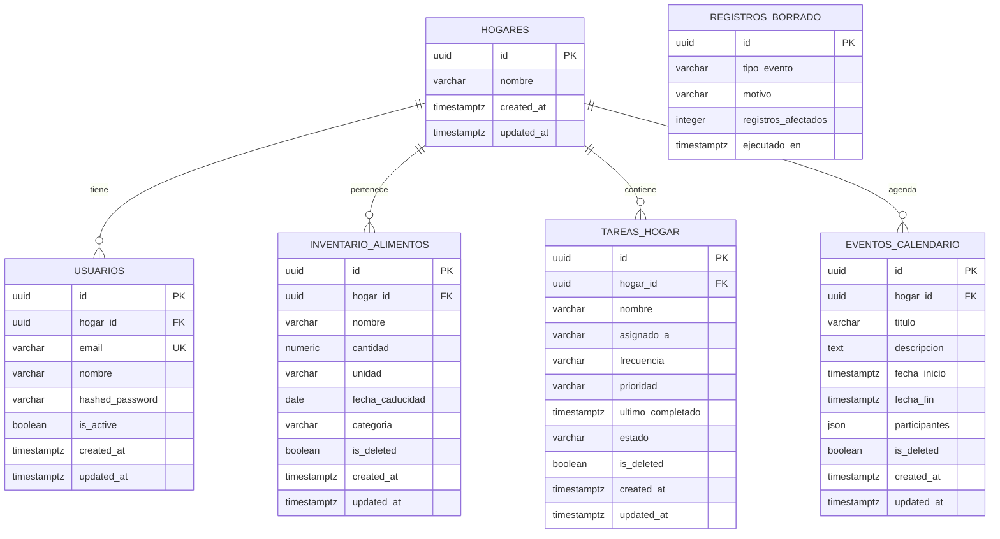

# 01_CONTEXTO_Y_ARQUITECTURA_APP

Este documento especifica la arquitectura del sistema, el esquema de la base de datos relacional, el contrato de la API y la **arquitectura de cumplimiento legal** (RGPD, Ley de IA de la UE, políticas de App Store / Google Play) para el **Asistente del Hogar IA**. Es la fuente de verdad para los agentes Frontend, Backend y Base de Datos.

> **Versión:** 2.1 (2026-06-12) — actualizado para reflejar el código real tras las fases F0–F-QA y la arquitectura de compliance (fase **F-LEGAL, implementada**): purga física RGPD, eliminación de cuenta, anonimización LLM y transparencia IA.

---

## 1. Estructura de Directorios del Monorepo

```text
AsistenteHogar/
├── backend/
│   ├── app/
│   │   ├── api/
│   │   │   ├── routers/           # auth, dashboard, pantry, calendar, tasks (FastAPI)
│   │   │   └── deps.py            # Inyección: sesión DB, get_current_user, get_hogar_id (JWT)
│   │   ├── core/                  # config, security (JWT/bcrypt), rate_limit, logging, utils
│   │   ├── models/                # Modelos SQLAlchemy 2.0 async (models.py)
│   │   ├── repositories/          # Acceso a datos (Patrón Repositorio) + exceptions tipadas
│   │   ├── schemas/               # Pydantic v2, extra='forbid' global (schemas.py)
│   │   ├── services/              # Lógica de negocio + integración LLM (llm.py)
│   │   │   └── privacy.py         # F-LEGAL: anonimización de prompts LLM (AnonimizadorLLM)
│   │   ├── jobs/                  # F-LEGAL: purga física programada (purge.py, CLI + scheduler)
│   │   ├── database.py            # Engine async + Base declarativa
│   │   └── main.py                # Entrada FastAPI + exception handlers globales
│   ├── alembic/versions/          # Migraciones Alembic
│   ├── smoke_test_*.py            # Suite de pruebas de humo (108 checks, incl. smoke_test_legal.py)
│   ├── docker-compose.yml         # PostgreSQL 16 (producción/local opcional)
│   ├── requirements.txt
│   └── .env.example
├── frontend/
│   ├── src/
│   │   ├── api/                   # api.ts — cliente fetch con Bearer token + timeout 15s
│   │   ├── components/            # AIDisclaimerBanner.tsx (transparencia IA, AI Act art. 50)
│   │   ├── config/                # config.ts — lee EXPO_PUBLIC_API_URL
│   │   ├── hooks/                 # useDashboard, usePantry, useCalendar, useTasks
│   │   ├── navigation/            # AppNavigator.tsx (tabs + auth gate)
│   │   ├── screens/               # Auth, Dashboard, Pantry, Calendar, Tasks
│   │   │   └── SettingsScreen.tsx # F-LEGAL: ajustes + eliminación de cuenta (zona de peligro)
│   │   ├── state/                 # authStore.ts (Zustand + expo-secure-store)
│   │   └── types/                 # types.ts — tipos compartidos del contrato API
│   ├── .env.development           # EXPO_PUBLIC_API_URL (sin secretos; gitignored)
│   ├── tailwind.config.js         # NativeWind v4
│   ├── App.tsx
│   └── package.json
├── CLAUDE.md                      # Guía de trabajo del repo
├── ENDPOINTS.md                   # Referencia completa de la API (contrato vigente)
├── ESTADO_ACTUAL.md               # Historial de fases y estado
└── 01_CONTEXTO_Y_ARQUITECTURA_APP.md  # Este documento
```

---

## 2. Principios Arquitectónicos Innegociables

1. **Multi-tenant por JWT:** `hogar_id` se deriva **siempre** del token validado (`get_hogar_id()` en `api/deps.py`). **Ningún endpoint acepta `hogar_id` en la URL, cabeceras o cuerpo.** Esto elimina por diseño la clase de vulnerabilidad IDOR/BOLA (OWASP API #1): un cliente no puede nombrar un hogar ajeno porque el identificador no existe en el contrato público.
2. **IA pasiva:** el LLM solo sugiere; **nunca escribe en la base de datos**. Toda mutación requiere confirmación explícita del usuario (p. ej. `POST /calendar/interpretar` devuelve una propuesta; el cliente confirma con `POST /calendar`).
3. **LLM determinista:** temperatura = 0 y `thinkingBudget = 0` en todas las llamadas a Gemini.
4. **Validación estricta:** todos los schemas Pydantic heredan de `BaseSchema` con `extra='forbid'`. Campos no declarados → 422.
5. **Capas:** Router → Service → Repository → Modelos. Los routers devuelven schemas Pydantic, nunca instancias ORM. Los repositories lanzan excepciones tipadas (`repositories/exceptions.py`) que los handlers globales de `main.py` mapean a códigos HTTP.
6. **Minimización de datos hacia el LLM:** ningún nombre propio de la familia sale hacia la API de Gemini sin pasar por la capa de anonimización (§5.2).

---

## 3. Esquema de Datos Relacional

PostgreSQL 16 en producción; SQLite (aiosqlite) en desarrollo y tests. Todas las marcas temporales son `TIMESTAMPTZ` normalizadas a UTC (TypeDecorator `TZDateTime`). UUIDs como claves primarias en todas las tablas.



### 3.1 Tablas existentes

* **`hogares`** — unidad de tenencia. `id UUID PK`, `nombre VARCHAR(100)`, timestamps. Relaciones declaradas con `cascade="all, delete-orphan"` hacia usuarios, alimentos, tareas y eventos.
* **`usuarios`** — cuentas de acceso. `id UUID PK`, `hogar_id FK → hogares.id ON DELETE CASCADE`, `email VARCHAR(255) UNIQUE INDEXED`, `nombre VARCHAR(100)`, `hashed_password VARCHAR(255)` (bcrypt), `is_active BOOLEAN`, timestamps.
* **`inventario_alimentos`** — `hogar_id FK CASCADE INDEXED`, `nombre VARCHAR(150)`, `cantidad NUMERIC(10,2) > 0`, `unidad VARCHAR(30)`, `fecha_caducidad DATE NULL`, `categoria VARCHAR(50)`, `is_deleted BOOLEAN INDEXED`, timestamps.
* **`tareas_hogar`** — `hogar_id FK CASCADE INDEXED`, `nombre VARCHAR(200)`, `asignado_a VARCHAR(100) NULL`, `frecuencia VARCHAR(50)`, `prioridad VARCHAR(20)` (`alta|media|baja`), `ultimo_completado TIMESTAMPTZ NULL`, `estado VARCHAR(30)` (`pendiente|completado`), `is_deleted BOOLEAN INDEXED`, timestamps.
* **`eventos_calendario`** — `hogar_id FK CASCADE INDEXED`, `titulo VARCHAR(200)`, `descripcion TEXT NULL`, `fecha_inicio/fecha_fin TIMESTAMPTZ` (fin > inicio, validado en Pydantic), `participantes JSON NULL` (lista de strings), `is_deleted BOOLEAN INDEXED`, timestamps.

### 3.2 Tabla: `registros_borrado` (auditoría de supresión)

Evidencia de cumplimiento del art. 17 RGPD (derecho de supresión) y del art. 5.2 (responsabilidad proactiva) **sin contener ningún dato personal**:

* **id**: `UUID PK`.
* **tipo_evento**: `VARCHAR(30)` — `'purga_programada'` | `'eliminacion_cuenta'`.
* **motivo**: `VARCHAR(100)` — p. ej. `'retencion_30_dias'`, `'solicitud_usuario'`.
* **registros_afectados**: `INTEGER` — recuento agregado (no IDs, no nombres).
* **ejecutado_en**: `TIMESTAMPTZ NOT NULL`.

Deliberadamente **no** guarda `hogar_id`, emails ni IDs de filas borradas: un registro de auditoría que identificara al usuario suprimido violaría la propia supresión. Solo acredita *que* el mecanismo se ejecutó, *cuándo* y *cuánto* eliminó.

### 3.3 Política de borrado (dos niveles)

| Nivel | Mecanismo | Alcance | Disparador |
|---|---|---|---|
| **Borrado lógico** | `is_deleted = TRUE` | inventario, tareas, eventos | `DELETE` de la API de negocio (deshacer/papelera, integridad referencial a corto plazo) |
| **Purga física** | `DELETE` SQL real | filas con `is_deleted = TRUE` y `updated_at` > 30 días | Job programado (§5.1) |
| **Destrucción de cuenta** | borrado del `hogar` → cascade ORM | hogar + usuarios + todos los datos vinculados | `DELETE /api/v1/auth/cuenta` (§4.2) |

> **Excepción documentada a la regla "sin hard deletes":** la purga programada y la destrucción de cuenta son los **dos únicos** caminos autorizados de borrado físico. Existen porque el RGPD exige supresión efectiva, no marcado lógico indefinido. Ningún otro código debe ejecutar `DELETE` físico.

---

## 4. Contrato de la API REST

Prefijo global `/api/v1`. Autenticación Bearer JWT (HS256, expiración 30 días). El contrato completo, con cuerpos y códigos por endpoint, vive en **`ENDPOINTS.md`**; aquí se resume la superficie y las decisiones de diseño.

### 4.1 Superficie actual (implementada)

| Módulo | Endpoints | Notas |
|---|---|---|
| Auth | `POST /auth/registro`, `POST /auth/login`, `GET /auth/me` 🔒, `DELETE /auth/cuenta` 🔒 | Rate limit por IP; login anti-enumeración; eliminación con re-autenticación (§4.2) |
| Dashboard | `GET /dashboard` 🔒 | Estado unificado de hoy + briefing IA (o fallback sin API key) |
| Despensa | `GET /pantry`, `GET /pantry/recetas`, `POST /pantry`, `PATCH /pantry/{id}`, `DELETE /pantry/{id}` 🔒 | Recetas = IA pasiva |
| Calendario | `GET /calendar`, `POST /calendar`, `POST /calendar/interpretar`, `PATCH /calendar/{id}`, `DELETE /calendar/{id}` 🔒 | Conflictos reportados en el GET (`conflictos[]`), no como 409 en el POST |
| Tareas | `GET /tasks`, `POST /tasks`, `PATCH /tasks/{id}`, `DELETE /tasks/{id}` 🔒 | |
| Salud | `GET /health`, `GET /` | Sin auth |

Decisiones de contrato que sustituyen al diseño original (v1.0 de este documento):

* **No hay `{hogar_id}` en ninguna ruta.** El diseño original (`/hogares/{hogar_id}/...`) exponía el identificador de tenant en la URL y obligaba a validar pertenencia en cada handler; era propenso a IDOR. El contrato vigente lo deriva del JWT.
* **`PATCH` en lugar de `PUT`** para actualizaciones parciales (todos los campos opcionales; cuerpo vacío → 400).
* **El briefing vive en `GET /dashboard`** (campo `briefing_texto`), no en un endpoint propio.
* **Crear un evento solapado devuelve 201**, y los solapamientos se informan como `conflictos[]` en `GET /calendar` y `conflictos_agenda[]` en el dashboard. La agenda familiar admite solapamientos legítimos; la IA los señala, el usuario decide.

Códigos de error comunes: `400` PATCH sin cuerpo · `401` token ausente/inválido · `404` recurso inexistente **o de otro hogar** (respuesta indistinguible, anti-enumeración cross-tenant) · `409` email duplicado · `422` validación · `429` rate limit.

### 4.2 Destrucción de cuenta

#### `DELETE /api/v1/auth/cuenta` 🔒

Requisito de App Store 5.1.1(v) y Google Play (eliminación de cuenta dentro de la app) + art. 17 RGPD.

* **Ruta bajo `/auth`, sin `{hogar_id}`** — el hogar a destruir se deriva del JWT, igual que el resto de la API. (El diseño alternativo `DELETE /hogares/{hogar_id}/usuarios/cuenta` se descartó por reintroducir IDOR.)
* **Re-autenticación obligatoria:** el cuerpo exige la contraseña actual. Un JWT robado/olvidado en un dispositivo no debe bastar para destruir los datos de toda la familia.

```json
// Body (CuentaEliminarRequest, extra='forbid')
{ "password": "contrasena_actual" }
```

* **Efecto:** borrado físico del `hogar` del token y de usuarios, inventario, tareas y eventos (incluidos los `is_deleted = true`). Se ejecuta vía cascade del ORM (`cascade="all, delete-orphan"`), no con `DELETE` SQL directo: SQLite no aplica `ON DELETE CASCADE` sin `PRAGMA foreign_keys` y el cascade en Python funciona igual en ambos motores. Inserta un registro agregado en `registros_borrado` (`tipo_evento = 'eliminacion_cuenta'`) en la misma transacción. Invalida la sesión (el token deja de resolver a un usuario existente → 401 en adelante).
* **Respuestas:** `200` `{ "success": true, "message": "Cuenta y datos eliminados permanentemente" }` · `401` token inválido o contraseña incorrecta · `422` validación. Rate limit: 5 intentos/hora por IP (anti fuerza bruta de contraseña).
* **Modelo de cuenta única familiar:** al existir un solo usuario por hogar en el modelo actual, eliminar la cuenta equivale a eliminar el hogar. Si en el futuro hay multiusuario por hogar, este endpoint deberá redefinirse (eliminar miembro vs. eliminar hogar).

---

## 5. Arquitectura de Cumplimiento Legal (F-LEGAL)

### 5.1 Purga física programada (RGPD art. 5.1.e — limitación del plazo de conservación)

* **Módulo:** `backend/app/jobs/purge.py`.
* **Lógica:** para cada tabla de negocio (`inventario_alimentos`, `tareas_hogar`, `eventos_calendario`): `DELETE WHERE is_deleted = TRUE AND updated_at < now() - 30 días`. Implementada como método `purge_expired()` en cada repository (única excepción autorizada de hard delete, §3.3), orquestada por un servicio `PurgeService`.
* **Ejecución:** doble vía —
  1. **Programada in-process:** tarea `asyncio` lanzada desde el evento `lifespan` de FastAPI, cada 24 h. Sin dependencias nuevas (coherente con el caché y rate-limit in-memory actuales; migrable a un scheduler externo en F5 junto con Redis).
  2. **Manual/CLI:** `python -m app.jobs.purge` para operaciones y verificación en tests.
* **Auditoría:** cada ejecución inserta una fila agregada en `registros_borrado` (`tipo_evento = 'purga_programada'`, `registros_afectados = N`). Si N = 0 no se inserta fila (evita ruido).
* **Logging:** resultado en el log estructurado existente (`logging_config.py`), sin datos personales.

### 5.2 Minimización y anonimización hacia el LLM (RGPD art. 5.1.c + EU AI Act)

Los prompts de `generate_morning_briefing` e `interpret_event_text` pueden contener nombres propios de la familia (`asignado_a`, `participantes`, texto libre). Antes de salir hacia la API de Gemini:

* **Módulo:** `backend/app/services/privacy.py` con una clase `AnonimizadorLLM`:
  1. **Construye el diccionario de alias** a partir de los nombres *conocidos estructuralmente* (valores de `asignado_a` de las tareas y elementos de `participantes[]` de los eventos) — no intenta NER sobre texto libre, que sería frágil; los campos estructurados son la fuente de verdad de qué es un nombre. Deduplica sin distinguir mayúsculas ('Ana' y 'ana' son la misma persona).
  2. **Sustituye** cada nombre por un token estable `Familiar_N` (orden determinista: alfabético; coincidencia con límites de palabra, los nombres más largos primero para que 'Ana' no rompa 'Ana María') en todo el material del prompt.
  3. **Revierte** los tokens a los nombres reales en la respuesta del LLM antes de devolverla al cliente, con reemplazo tolerante a variaciones de espaciado (`Familiar_1`, `Familiar 1`).
* **Orden con el caché (crítico):** la clave SHA-256 del caché TTL en `llm.py` se calcula **sobre el prompt ya anonimizado**, y el caché almacena la **respuesta anonimizada** (la reversión se aplica después del caché). Así dos hogares con datos iguales salvo nombres comparten semántica sin fugas cruzadas, y la entrada cacheada nunca contiene datos personales.
* **Alcance:** se aplica en `generate_morning_briefing`, la única función cuyo prompt contiene nombres conocidos estructuralmente. `generate_recipe_suggestions` solo envía nombres de alimentos e `interpret_event_text` recibe texto libre sin fuente estructural de nombres (aplicar NER ahí sería frágil y daría falsa sensación de seguridad; está documentado en el propio código).
* **Fallbacks estáticos** (sin `GEMINI_API_KEY`): no pasan por la red, no requieren anonimización.

### 5.3 Transparencia de IA (EU AI Act art. 50 — contenido generado por IA)

* **Componente:** `frontend/src/components/AIDisclaimerBanner.tsx` (NativeWind), texto fijo: *«Este resumen ha sido generado por IA y puede contener imprecisiones.»*
* **Ubicaciones:** junto al `briefing_texto` en `DashboardScreen`, junto a las recetas IA en `PantryScreen`, y como línea del diálogo de confirmación de la propuesta de evento en `CalendarScreen` («🤖 Propuesta generada por IA — revísala antes de confirmar.»).
* **Condición:** solo se muestra cuando el contenido proviene realmente del LLM: el backend expone `generado_por_ia` en recetas y `briefing_generado_por_ia` en `DashboardUnifiedContext`, de modo que el fallback estático nunca se etiqueta como IA.

### 5.4 Flujo de eliminación de cuenta en el cliente

* **Pantalla:** `frontend/src/screens/SettingsScreen.tsx` (pestaña "Ajustes" ⚙️), con datos de la cuenta, cierre de sesión y sección "Zona de peligro" con el botón destructivo **«Eliminar cuenta permanentemente»**.
* **Confirmación inline en dos pasos** (no `Alert` nativo: en react-native-web los botones de `Alert.alert` no funcionan, y el backend exige la contraseña, así que el campo debe estar en pantalla): el botón revela un panel de advertencia con campo de contraseña + «Confirmar eliminación definitiva» + «Cancelar».
* **Acción Zustand** `deleteAccount(password)` en `authStore.ts`:
  1. `DELETE /api/v1/auth/cuenta` con la contraseña.
  2. Si 200: limpia el estado global y `expo-secure-store` (best-effort, mismo patrón try/catch que `logout`); el gate de `AppNavigator` detecta sesión nula y muestra `AuthScreen` (Login).
  3. Si 401 (contraseña incorrecta): propaga el error, la pantalla lo muestra y **no** se cierra la sesión (el cliente API no auto-desloguea en 401 de rutas `/auth/*`).

---

## 6. Integración LLM (estado actual)

`backend/app/services/llm.py` — tres funciones sobre Gemini (`GEMINI_MODEL`, default `gemini-2.5-flash`):

| Función | Uso | Caché TTL |
|---|---|---|
| `generate_morning_briefing` | `GET /dashboard` → `briefing_texto` | 30 min |
| `generate_recipe_suggestions` | `GET /pantry/recetas` | 60 min |
| `interpret_event_text` | `POST /calendar/interpretar` | — |

Temperatura 0, `thinkingBudget` 0. Claves de caché = SHA-256 de los datos del prompt (en el briefing, del prompt **ya anonimizado**, §5.2). `generate_morning_briefing` devuelve `(texto, generado_por_ia)` para alimentar el aviso de transparencia. Sin `GEMINI_API_KEY` las tres devuelven fallbacks estáticos y la app sigue funcionando.

---

## 7. Frontend (estado actual)

* **Estado de sesión:** Zustand (`src/state/authStore.ts`) — token JWT, usuario, hogar. Persistencia cifrada en `expo-secure-store` con try/catch best-effort (en web la sesión vive solo en memoria). `hydrate()` restaura sesión al arrancar.
* **Cliente API:** `src/api/api.ts` — añade `Authorization: Bearer <token>`, timeout por defecto `AbortSignal.timeout(15000)`, distingue `TimeoutError` de errores de red.
* **Hooks de datos:** `use{Dashboard,Pantry,Calendar,Tasks}.ts` — `AbortController` con cleanup en `useEffect`, `refetch` como wrapper sin argumentos, actualizaciones optimistas con rollback en tareas.
* **Config:** `EXPO_PUBLIC_API_URL` en `frontend/.env.development` (variables embebidas en build: cambiarla exige `npx expo start --clear`). **Nunca** colocar secretos del backend bajo `frontend/` (ambos `.env` están gitignored).

---

## 8. Historial de decisiones de arquitectura

| Decisión | Estado | Motivo |
|---|---|---|
| `{hogar_id}` en URL (v1.0) | ❌ Sustituida | IDOR; el tenant sale del JWT (`get_hogar_id`) |
| `PUT` para actualizaciones (v1.0) | ❌ Sustituida | `PATCH` parcial con Pydantic opcional |
| `409 CONFLICTO_SOLAPAMIENTO` en POST eventos (v1.0) | ❌ Sustituida | Los solapamientos son legítimos en agenda familiar; se informan, no se bloquean |
| Soft delete universal | ✅ Vigente con excepción | Purga programada + destrucción de cuenta son los únicos hard deletes (§3.3) |
| Caché/rate-limit in-memory | ✅ Vigente (deuda) | Migrar a Redis en F5 si hay múltiples workers |
| IA pasiva | ✅ Vigente | El usuario confirma toda escritura |
