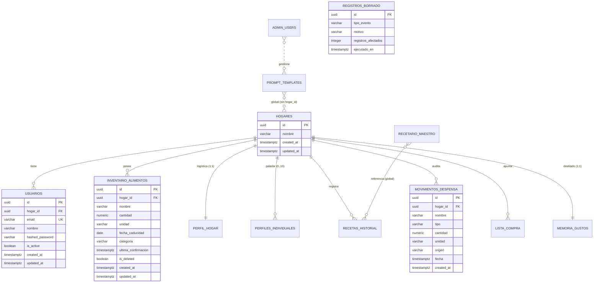

# Contexto y Arquitectura Global — AsistenteHogar

Este documento especifica de manera integral la arquitectura del sistema, el mapa de directorios, el esquema de datos, el sistema de diseño visual y la arquitectura de cumplimiento legal (RGPD / AI Act) para el **Asistente del Hogar IA**. Es la fuente de verdad conceptual del proyecto.

> **Versión:** 4.1 (2026-06-24) — **Pivote 2 implementado**: App exclusivamente orientada a comida, despensa y recetas mediterráneas. Se eliminaron las tareas domésticas y la agenda/calendario. Gate freemium invertido: OCR/foto/voz/texto son gratis; Premium = Informe de Ahorro + recetas IA avanzadas. AhorroService y parser de ticket Mercadona en producción.

---

## 1. Mapa de Sistema y Directorios

El monorepo está organizado para separar de forma limpia la app móvil (Expo), el panel de administración (Next.js) y la API del servidor (FastAPI).

### 1.1 Estructura del Monorepo

```text
AsistenteHogar/
├── backend/
│   ├── app/
│   │   ├── api/
│   │   │   ├── routers/           # auth, dashboard, pantry, perfiles, chef, lista_compra, ahorro
│   │   │   └── deps.py            # Inyección: DB sessions, get_current_user, requiere_premium/familia
│   │   ├── core/                  # config, security (JWT/bcrypt), rate_limit, token_blocklist
│   │   ├── models/                # Modelos SQLAlchemy 2.0 async (models.py)
│   │   ├── repositories/          # Patrón Repositorio y exceptions tipadas
│   │   ├── services/              # Lógica de negocio: llm.py, premium.py, memoria.py, ahorro.py, ticket_parser.py
│   │   │   └── privacy.py         # AnonimizadorLLM (saneo y tokenización de prompts)
│   │   ├── jobs/                  # scheduled jobs: purga física programada (purge.py)
│   │   ├── database.py            # Async engine + Declarative Base
│   │   └── main.py                # Entrada FastAPI y Lifespan (migrations + HTTP handlers)
│   ├── alembic/versions/          # Migraciones Alembic
│   ├── smoke_test_*.py            # Suite de pruebas de humo (15 test suites individuales)
│   ├── Procfile                   # Comando de arranque (Railway)
│   └── requirements.txt
├── frontend/
│   ├── src/
│   │   ├── api/                   # api.ts (fetch client con JWT Bearer + timeouts)
│   │   ├── components/            # ui/ (lote de componentes), AIDisclaimerBanner.tsx
│   │   ├── hooks/                 # useDashboard, usePantry, useListaCompra, useChefChat
│   │   ├── lib/                   # haptics.ts, notifications.ts, caducidad.ts, categoria.ts
│   │   ├── navigation/            # AppNavigator.tsx (Stack + Bottom Tabs + Auth/Onboarding Gates)
│   │   ├── screens/               # AuthScreen, DashboardScreen, PantryScreen, ChefChatScreen, etc.
│   │   ├── state/                 # authStore.ts (Zustand + secure store), purchasesStore.ts
│   │   ├── theme/                 # tokens.ts (Tierra Cálida design tokens, sin NativeWind)
│   │   └── types/                 # types.ts (Tipos de contrato API y frontend)
│   ├── app.json                   # Configuración de Expo y EAS
│   └── package.json
├── admin-web/
│   ├── src/
│   │   ├── app/                   # Next.js App Router (login, prompts, recetario)
│   │   ├── components/            # AdminNav, PromptEditor, RecetaForm
│   │   └── lib/                   # api.ts (llamadas tipadas con cabecera CSRF)
│   └── nixpacks.toml              # Build settings de Vercel
├── ENDPOINTS.md                   # Referencia de API
└── ESTADO_ACTUAL.md               # Roadmap e Historial
```

### 1.2 Mapa Conceptual de Componentes y Flujos

```mermaid
graph TB
    subgraph Cliente["📱 App móvil (Expo / React Native)"]
        Home["Inicio — briefing + alertas"]
        Desp["Despensa — stock + foto nevera + ticket + voz"]
        Chat["Chef — Chat con Marce (Zustand)"]
        Ajustes["Ajustes — perfiles + config umbral"]
    end

    subgraph Admin["🖥️ Panel Admin (Next.js — admin-web/)"]
        AdmRec["CRUD Recetario Maestro"]
        AdmPrompt["Editor de Prompts / System Instructions"]
        AdmAuth["Login super-admin (JWT admin HttpOnly)"]
    end

    subgraph API["⚙️ Backend FastAPI"]
        RAuth["/auth (usuarios, JWT)"]
        RAdmin["/admin/* (super-admin, cookies HttpOnly + CSRF)"]
        RPantry["/pantry/* (stock, recetas, Vision, audio)"]
        RDash["/dashboard (briefing despensa)"]
        RPerfil["/onboarding (perfil hogar)"]
        RPerfilInd["/perfiles (miembros individuales)"]
        RHist["/pantry/recetas/historial (feedback)"]
        RLista["/lista-compra (CRUD lista compra) ✅"]
        RChef["/chef/chat (chat estructurado)"]
        RAhorro["/ahorro (informe de ahorro — preview gratis / resumen premium)"]
        PromptSvc["PromptConfigService (BD + caché TTL 5m)"]
        LLM["services/llm.py (Gemini 2.5 Flash)"]
        Premium["premium.py (RevenueCat status)"]
    end

    subgraph DB["🗄️ PostgreSQL (Railway) / SQLite (Dev)"]
        Thog["hogares / usuarios / admin_users"]
        Tstock["inventario_alimentos"]
        Tperfh["perfil_hogar (logística)"]
        Tperfi["perfiles_individuales"]
        Thist["recetas_historial"]
        Trec["recetario_maestro (GLOBAL)"]
        Tprompt["prompt_templates (GLOBAL)"]
        Tborr["registros_borrado (RGPD)"]
        Tlista["lista_compra (por hogar)"]
        Tmem["memoria_gustos (destilada)"]
        Tmov["movimientos_despensa (ledger)"]
    end

    Gemini["☁️ Gemini 2.5 Flash"]
    RC["💳 RevenueCat (IAP)"]

    Home & Desp & Chat & Ajustes -->|Bearer JWT familia| API
    AdmRec & AdmPrompt -->|HttpOnly + CSRF| RAdmin
    AdmAuth --> RAdmin
    RAdmin --> Trec & Tprompt & Thog
    RPantry & RDash & RChef --> LLM
    LLM --> PromptSvc
    PromptSvc --> Tprompt
    LLM -->|recetario en context cache| Gemini
    RPantry & RChef --> Premium
    Premium --> RC
    RPerfil --> Tperfh
    RPerfilInd --> Tperfi
    RPantry --> Tstock
    RHist --> Thist
    RLista --> Tlista
    RDash --> Tstock
    RAhorro --> Tmov
    RAhorro --> Premium
    RChef --> Tmem & Tmov
```



---

## 2. Principios Arquitectónicos Innegociables

1.  **Multi-tenant por JWT**: El identificador `hogar_id` se deriva **siempre** del token JWT validado en `deps.py` (`get_hogar_id()`). Ningún endpoint acepta `hogar_id` en el cuerpo o cabeceras del cliente. Esto previene vulnerabilidades IDOR/BOLA por diseño.
2.  **IA Pasiva / Confirmación Directa**: Los modelos de IA sugieren y proponen cambios (ej: `/pantry/interpretar` o `/pantry/foto-nevera`); la escritura real en base de datos la decide el usuario de forma explícita. Se permiten escrituras de bajo riesgo (descontar stock al cocinar) siempre que tengan un *Deshacer* visible en la interfaz.
3.  **LLM Determinista**: Temperatura = 0 y `thinkingBudget = 0` para asegurar que las respuestas y structured outputs de Gemini sean predecibles.
4.  **Validación Cerrada**: Todos los schemas de Pydantic heredan de `BaseSchema` con `extra='forbid'`, provocando un error `422 Unprocessable Entity` si se envían parámetros no declarados.
5.  **Aislamiento de Capas**:
    ```text
    Router (FastAPI) → Service (Lógica) → Repository (SQLAlchemy) → Modelos ORM
    ```
    Los routers reciben y devuelven únicamente schemas Pydantic, nunca instancias de modelos ORM.
6.  **Minimización de Datos (LLM)**: No se envían nombres propios a Gemini; se sustituyen mediante `AnonimizadorLLM` por tokens `Familiar_N`. Los perfiles individuales utilizan apodos/pseudónimos gastronómicos ("Mamá", "El peque"), nunca información médica o de identidad legal.

---

## 3. Esquema de Datos Relacional

PostgreSQL 16 es el motor de producción en Railway; SQLite (aiosqlite) se utiliza para desarrollo local y smoke tests. Todas las marcas de tiempo se almacenan con huso horario (`TIMESTAMPTZ` o `DateTime(timezone=True)`) y son tratadas como UTC mediante el decorador de tipo `TZDateTime`.



### 3.1 Resumen de Tablas e Integridad
*   **`hogares`**: Unidad de aislamiento tenant. Los DELETE cascada del ORM se gestionan aquí.
*   **`usuarios`**: Contraseñas hasheadas con bcrypt (longitud máx. 72 bytes por limitación de bcrypt).
*   **`inventario_alimentos`**: El inventario del hogar. Incluye `ultima_confirmacion` para calcular la confianza del stock y la bandera `is_deleted` (borrado lógico).
*   **`movimientos_despensa`**: Ledger histórico de entradas/salidas (compra, consumo, merma) que alimenta la inteligencia de stock.
*   **`perfil_hogar`**: Configuración de onboarding básica (comensales, gustos generales).
*   **`perfiles_individuales`**: Hasta 10 miembros por hogar. Guarda preferencias gastronómicas excluyendo datos de salud.
*   **`memoria_gustos`**: Resumen NL destilado por la IA sobre lo que le gusta y consume al hogar.
*   **`lista_compra`**: Lista del súper del hogar.
*   **`registros_borrado`**: Registro de auditoría agregada del RGPD (sin nombres ni IDs).
*   **`admin_users`, `prompt_templates`, `recetario_maestro`**: Entidades globales sin `hogar_id`, restringidas al Panel de Administración.

---

## 4. Sistema de Diseño Visual y Componentes UI

El frontend móvil está rediseñado en calidad nativa utilizando **únicamente StyleSheet y tokens de diseño**, tras la desinstalación completa de NativeWind/Tailwind.

### 4.1 Paleta "Tierra Cálida" (`src/theme/tokens.ts`)

La estética está inspirada en un minimalismo cálido y editorial (tonos crema y marrones), donde el ingrediente y la comida toman protagonismo.

| Token | Hex | Propósito |
|---|---|---|
| `brand` | `#8B5E3C` | Marrón arcilla (botones primarios, FAB, tabs activos) |
| `brandDark` | `#6B4429` | Tono para estado pressed (Pressed) |
| `brandSoft` | `#F6EDE3` | Fondo de pastillas, banners y chips activos |
| `bg` | `#FAF7F2` | Lino cálido (fondo de pantalla general) |
| `card` | `#FFFDF8` | Crema elevado (superficies de tarjetas principales) |
| `cardAlt` | `#F9F4EC` | Tono secundario para tarjetas de soporte |
| `ink` | `#2C1C0E` | Marrón oscuro (texto principal de alta legibilidad) |
| `inkMuted` | `#7A6045` | Texto secundario y leyendas |
| `inkFaint` | `#AE9B87` | Placeholders y separadores suaves |
| `border` | `#EAE0D3` | Bordes de tarjetas y líneas divisorias |
| `success` | `#5C8B68` | Verde salvia (semáforo de stock fresco > 6 días) |
| `warning` | `#C8783A` | Ámbar arcilla (semáforo de consumo pronto 4-6 días) |
| `danger` | `#B84B2D` | Rojo terracota (semáforo urgente ≤ 3 días / caducado) |

### 4.2 Tipografía, Radios y Sombras
*   **Tipografía**: Se apoya en las fuentes del sistema nativo (SF Pro en iOS, Roboto en Android) para evitar tiempos de carga y problemas de rendering. Escala:
    *   `display` (28, Bold) / `title` (22, Bold) / `h2` (17, Bold) / `body` (15, Medium) / `caption` (13, Medium) / `label` (11, ExtraBold uppercase).
*   **Radios**: Curvaturas suaves y sobredimensionadas (`sm: 12`, `md: 16`, `lg: 20`, `xl: 24`, `pill: 999`).
*   **Sombras**: warm-tinted (`shadowColor: '#3D2B1A'` en iOS, `elevation` en Android).

### 4.3 Componentes Comunes (`src/components/ui/`)
-   `Screen`: Contenedor principal con safe-areas y soporte para pull-to-refresh nativo.
-   `Card`: Superficie interactiva que implementa sombras cálidas.
-   `Button`: Variantes (primary, secondary, ghost, danger) con Haptics y estados de carga integrados.
-   `AppText`: Encapsulador de texto tipográfico del sistema.
-   `StatCard` / `EmptyState` / `Badge` / `Fab`.

### 4.4 Iconografía
-   Iconos vectoriales vía `@expo/vector-icons` (Ionicons + MaterialCommunityIcons); `FoodIcon`
    para ingredientes (`src/components/ui/Icon.tsx`). **Sin emoji en la UI.**
-   Área táctil mínima: **44×44 pt (iOS) / 48×48 dp (Android)**.

### 4.5 Anti-patrones (prohibido)
Reglas no negociables del sistema de diseño; verificar antes de cualquier trabajo de UI:

- ❌ Gradientes púrpura / azul / genéricos.
- ❌ Sombras azul-frío (`shadowColor: '#1E2A4A'`) — las sombras son warm-tinted.
- ❌ Fondo `#FFFFFF` puro o `#F5F6FA` gris frío.
- ❌ Texto negro `#000000` o `#111827` frío.
- ❌ Fuentes Inter / Roboto hardcodeadas (se usan las del sistema).
- ❌ `className` de NativeWind/Tailwind (eliminadas del stack).
- ❌ Más de 1 color de acento por pantalla.
- ❌ Radios de 4–8 px en elementos interactivos (usar la escala `radius`).

> Skill de diseño activo: `~/.claude/skills/mobile-app-design/` (touch targets, contraste WCAG).
> `src/theme/tokens.ts` es la **única fuente de verdad**: no hardcodear valores en componentes.

---

## 5. Arquitectura de Cumplimiento Legal (RGPD & AI Act)

### 5.1 Mecanismo de Borrado en Dos Niveles
1.  **Borrado Lógico**: La acción ordinaria del usuario en la app marca `is_deleted = true` y actualiza `updated_at`. Esto asegura la integridad referencial inmediata y permite la opción de "Deshacer".
2.  **Purga Física Programada (RGPD art. 5.1.e)**: Cada 24 horas, la tarea de ciclo de vida en `backend/app/jobs/purge.py` realiza un `DELETE` físico real para todas las filas marcadas como borradas hace más de 30 días.
3.  **Destrucción de Cuenta**: `DELETE /api/v1/auth/cuenta` requiere la contraseña del usuario (re-autenticación) y utiliza cascade a nivel de base de datos para borrar físicamente todas las dependencias del hogar en una sola transacción, dejando registro agregado en `registros_borrado`.

### 5.2 Capa de Privacidad: AnonimizadorLLM (`privacy.py`)
Para evitar que se envíe información de identificación personal (PII) a la API de Gemini:
-   `AnonimizadorLLM` tokeniza nombres conocidos del prompt y los sustituye por placeholders neutros (`Familiar_1`, `Familiar_2`).
-   La clave de caché SHA-256 en Redis se genera a partir del prompt **ya anonimizado**.
-   Al retornar la respuesta de la IA, los placeholders son reemplazados de vuelta por los nombres locales antes de que la respuesta llegue a la UI.

### 5.3 Transparencia de IA (EU AI Act art. 50)
Cualquier fragmento de texto o plan de la app generado por un modelo LLM debe incluir en la interfaz el componente `<AIDisclaimerBanner />` (*«Este resumen ha sido generado por IA y puede contener imprecisiones.»*). El banner se renderiza de forma condicional basándose en los flags `generado_por_ia` de los payloads REST, evitando etiquetar como IA las respuestas estáticas de fallback.

### 5.4 Alineamiento con la Ley 1/2025 de Prevención del Desperdicio Alimentario (España)

La Ley 1/2025, de 9 de enero, establece obligaciones para agentes de la cadena alimentaria en materia de reducción del desperdicio. La app actúa como herramienta de apoyo al ciudadano con el objetivo de:
- Planificar el consumo a partir del stock real de la despensa (módulo de recetas de aprovechamiento).
- Alertar sobre caducidades próximas para priorizar el consumo antes del vencimiento.
- Cuantificar el impacto en euros y kilogramos mediante el `AhorroService` (North Star Metric: kg de desperdicio evitado/mes por hogar activo, referencia MAPA 2024: 31 kg/persona/año).

La app no es un operador de la cadena alimentaria bajo la definición de la Ley, sino una herramienta de consumidor final; no obstante, el posicionamiento comercial y los textos legales deben hacer referencia explícita a este propósito para reforzar la narrativa anti-desperdicio ante Apple/Google y usuarios.
