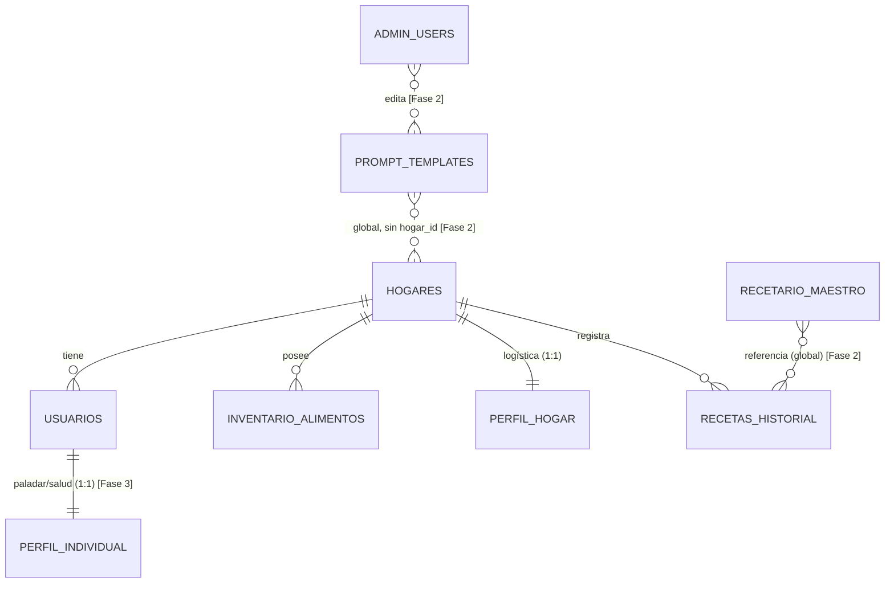
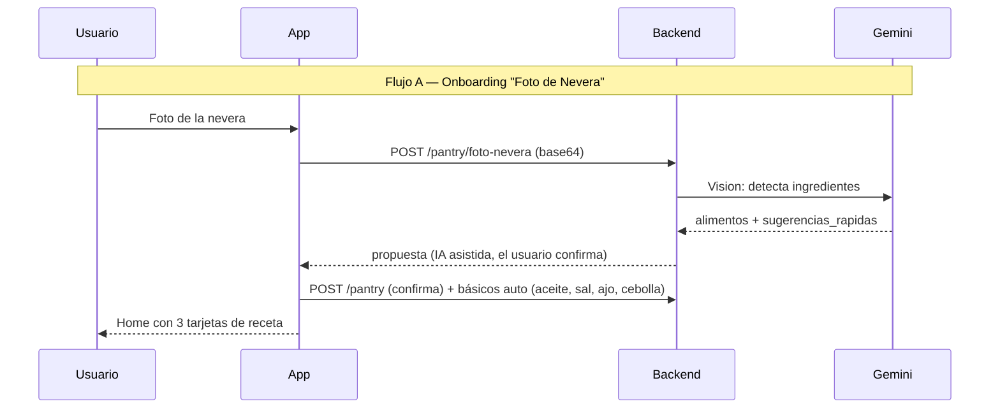

# ARCHITECTURE_MAP — Asistente del Hogar IA (app de comida)

> App **exclusiva de comida, stock y recetas mediterráneas españolas**. Tras el
> Pivote 2 se eliminaron los módulos de Eventos (calendario) y Tareas (domésticas).
> Núcleo: stock real de la despensa → recetas de aprovechamiento personalizadas.

## Mapa de sistema

```mermaid
graph TB
    subgraph Cliente["📱 App móvil (Expo / React Native)"]
        Home["Inicio — briefing + 3 tarjetas de receta"]
        Desp["Despensa — stock + foto nevera + ticket + voz"]
        Chat["Chat con el Chef (futuro)"]
        Ajustes["Ajustes + Perfiles"]
    end

    subgraph Admin["🖥️ Panel Admin (Next.js — admin-web/) [Fase 2]"]
        AdmRec["CRUD Recetario Maestro"]
        AdmPrompt["Editor de Prompts / System Instructions"]
        AdmAuth["Login super-admin (auth separada)"]
    end

    subgraph API["⚙️ Backend FastAPI"]
        RAuth["/auth (familias, JWT)"]
        RAdmin["/admin/* (super-admin, JWT admin) [Fase 2]"]
        RPantry["/pantry/* (stock, recetas, foto, ticket, voz)"]
        RDash["/dashboard (briefing despensa)"]
        RPerfil["/onboarding (+ perfil individual [Fase 3])"]
        RHist["/pantry/recetas/historial"]
        PromptSvc["PromptConfigService (caché TTL) [Fase 2]"]
        LLM["services/llm.py (_call_gemini)"]
        Premium["premium.py (gate premium)"]
    end

    subgraph DB["🗄️ PostgreSQL"]
        Thog["hogares / usuarios"]
        Tstock["inventario_alimentos"]
        Tperfh["perfil_hogar (logística)"]
        Tperfi["perfil_individual [Fase 3]"]
        Thist["recetas_historial"]
        Trec["recetario_maestro (GLOBAL) [Fase 2]"]
        Tprompt["prompt_templates (GLOBAL) [Fase 2]"]
        Tadmin["admin_users (GLOBAL) [Fase 2]"]
        Tborr["registros_borrado (RGPD)"]
    end

    Gemini["☁️ Gemini 2.5 Flash<br/>structured output · vision · context caching [Fase 4]"]
    RC["💳 RevenueCat<br/>Free / Premium1 / Premium2"]

    Home & Desp & Chat & Ajustes -->|Bearer JWT familia| API
    AdmRec & AdmPrompt -->|Bearer JWT admin| RAdmin
    AdmAuth --> RAdmin
    RAdmin --> Trec & Tprompt
    RPantry & RDash --> LLM
    LLM --> PromptSvc
    PromptSvc -->|lee con caché| Tprompt
    LLM -->|recetario en context cache| Gemini
    RPantry --> Premium
    Premium -->|valida entitlement| RC
    RPerfil --> Tperfh & Tperfi
    RPantry --> Tstock
    RHist --> Thist
    RDash --> Tstock
```

## Modelo de datos

Tablas vivas hoy: `hogares`, `usuarios`, `inventario_alimentos`, `perfil_hogar`,
`recetas_historial`, `registros_borrado`. Eliminadas en el Pivote 2:
`eventos_calendario`, `tareas_hogar` (migración `d3e5f7b91a26`).

## Flujos clave

- **Flujo B (Ticket + planificador, Premium2):** foto ticket → normaliza
  abreviaturas del súper → actualiza stock → menú 7 días encadenando
  aprovechamiento (Lunes cocido → Martes ropa vieja).
- **Flujo C (Depleción + feedback):** "Terminar receta" descuenta stock estimado
  con confirmación ligera; micro-preguntas A/B (máx. cada 3 días) afinan el perfil.

## Modelo de monetización (RevenueCat)

| Tier | Precio | Incluye |
|---|---|---|
| **Free** | 0 € | Recetario maestro + stock manual + 3-5 créditos IA/mes |
| **Premium 1** | 1,99 €/mes | Escaneo de tickets, foto de nevera y chat con el chef ilimitados |
| **Premium 2** | 4,99 €/mes | Todo lo anterior + planificador semanal de aprovechamiento + analítica nutricional invisible |

## Estado por fases

- **Fase 1 (hecha):** demolición Eventos+Tareas, app 100% comida, docs + este mapa.
- **Fase 2:** `recetario_maestro` + `prompt_templates` dinámicos desde BD con caché TTL + panel admin Next.js (super-admin global).
- **Fase 3:** perfiles doble capa (`perfil_hogar` logística + `perfil_individual` paladar/salud). Datos de salud con consentimiento explícito (RGPD art. 9).
- **Fase 4:** context caching de Gemini (recetario maestro) + function calling (ajuste de perfil al rechazar ingredientes).
- **Fase 5:** RevenueCat 3 tiers + flujos A/B/C completos.
