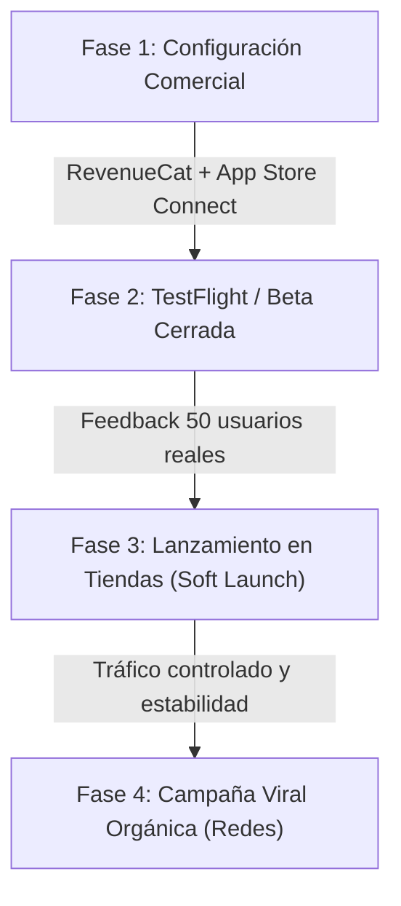

# Estrategia Comercial, Marketing y Ventas — AsistenteHogar

Este documento detalla la estrategia comercial, el modelo de monetización y el plan de captación de usuarios para el lanzamiento y escalado de **AsistenteHogar**.

> **Versión:** 1.1 (2026-06-23) — Ampliación Growth Hacker: North Star Metric, viral loop, SEO y canal Reddit.

---

## 1. Modelo de Monetización (Freemium & Premium Gates)

Implementamos un modelo **Freemium híbrido** diseñado para maximizar la viralidad inicial sin disparar los costes operativos de infraestructura e IA (Gemini API).

### 1.1 Estructura de Tiers

| Característica | Nivel Gratuito (Freemium) | Nivel Premium (Suscripción) |
|---|---|---|
| **Gestión de Despensa** | Manual (añadir, editar, agotar) | Manual + Automatizado |
| **Sugerencias de Recetas** | Básicas (hasta 3 platos simples) | Avanzadas (recetas complejas y de temporada) |
| **Chef Marce Chat** | **Máximo 10 mensajes al día** | **Mensajes ilimitados** |
| **OCR de Tickets** | **Gratis (15/día)** | **Ilimitado** (Gemini Vision) |
| **Foto-Nevera** | **Gratis (15/día compartido con OCR)** | **Ilimitado** (Gemini Vision) |
| **Informe de Ahorro** | Preview limitada (cifra parcial) | **Completo** (desglose por receta y período) |
| **Planificador de Menús** | No disponible | **Semanal completo** (7 días) |

### 1.2 Integración Comercial (RevenueCat)
*   **Gate Premium Server-Side:** Validado mediante webhooks y comprobación de estado de suscripción con `REVENUECAT_SECRET_KEY` en el backend.
*   **Conversión:** Al superar el mensaje 10 del día en el chat con Marce, el servidor responde con un código de estado `402 Payment Required`, que navega automáticamente en el frontend a la pantalla de pago (`PaywallScreen`). El motor principal de conversión es el **Informe de Ahorro**: los usuarios free ven una preview con la cifra parcial; el desglose completo requiere premium.
*   **Estrategia de Precios (Baja Fricción):**
    *   **Mensual:** 2,99 €/mes (compra impulsiva, ideal para probar la comodidad del OCR).
    *   **Anual:** 19,99 €/año (descuento del ~45% sobre el mensual; ayuda al flujo de caja inicial).

---

## 2. Canales de Adquisición (Tracción de Bajo Coste)

Como equipo de ejecución ágil (solopreneur), la inversión publicitaria inicial en Ads será de 0 €. Priorizamos el crecimiento orgánico apalancándonos en el propio contenido del producto.

### 2.1 Vídeos Cortos Orgánicos (TikTok, Instagram Reels y YouTube Shorts)
El contenido culinario y de trucos del hogar tiene una alta viralidad orgánica. Crearemos contenido enfocado en el concepto **"Nevera Vacía / Reto Aprovechamiento"**:
1.  **Formato de Vídeo:**
    *   Grabar una nevera real donde parece que "no hay nada" (ej. un huevo, media cebolla y un calabacín).
    *   Grabar la pantalla del móvil escaneando el ticket o haciendo una foto de los ingredientes con la app.
    *   Mostrar la receta creativa que propone Marce y el proceso de cocinado rápido.
    *   Finalizar mostrando el coste estimado que se ha ahorrado al no tirar esos ingredientes.
2.  **Mensaje Fuerza:** *"Deja de tirar comida a la basura. Marce cocina por ti con lo que te queda."*

### 2.2 Optimización de Tiendas de Apps (ASO)
Dado que gran parte del tráfico de apps móviles es orgánico de búsqueda, optimizaremos los metadatos y capturas en App Store y Google Play:
*   **Keywords Clave:** *aprovechar comida, recetas mediterráneas, qué cocinar hoy, organizar nevera, lista de compra inteligente, menús semanales, recetas fáciles.*
*   **Línea Visual:** Capturas limpias usando el diseño "Tierra Cálida" (tonos crema y marrón arcilla) que destaquen la sencillez frente a los gestores de tareas grises y corporativos.

---

## 3. Landing Page de Conversión

Una página web estática de alta conversión (Next.js o Vite) para dirigir a los usuarios móviles directamente a las tiendas oficiales de descarga.

### 3.1 Secciones Clave
1.  **Hero:**
    *   Título: *«¿Qué cenamos hoy con lo que hay en la nevera?»*
    *   Subtítulo: *«Tu despensa bajo control. Recetas mediterráneas de aprovechamiento con el Chef Marce.»*
    *   Botones destacados de descarga (App Store y Google Play).
2.  **Chef Marce Simulator (Interactive Hook):**
    *   Un widget web interactivo donde el visitante puede escribir 3 ingredientes que tenga en su casa.
    *   Llama en tiempo real a una versión restringida de la API para devolver una receta propuesta por Marce al instante.
    *   Límite de 1 prueba por dirección IP/sesión; botón de *"Descarga la app para cocinar ilimitado con Marce"* al terminar.
3.  **Beneficios Clave:**
    *   **Cero Desperdicio (Zero Waste):** Alertas automáticas cuando tus ingredientes están listos para caducar.
    *   **Ahorro de Tiempo y Dinero:** Lista de la compra generada sola según tus hábitos reales.
    *   **Voz e Imagen:** Habla directamente con tu chef o sube fotos de tus tickets de supermercado.

---

## 4. Fase de Lanzamiento (Soft Launch)

Para asegurar la robustez técnica del backend en producción antes de realizar campañas virales, seguiremos un proceso de lanzamiento en fases.

1.  **Fase 1 (Suscripción y Webhooks):** Integrar RevenueCat en sandbox. Confirmar que el webhook de Railway procesa la expiración de la suscripción.
2.  **Fase 2 (Prueba de Humo Humana):** Subir la app a TestFlight (iOS) y Google Play Beta Cerrada. Invitar a 50 usuarios seleccionados para detectar fallos reales de UX/UI y bugs de la IA.
3.  **Fase 3 (Lanzamiento Técnico):** Publicar abiertamente en las tiendas pero sin hacer ruido comercial. Monitorear los logs y el consumo de tokens de Gemini.
4.  **Fase 4 (Campaña de Growth):** Lanzamiento de los primeros vídeos en redes sociales y optimización ASO.
